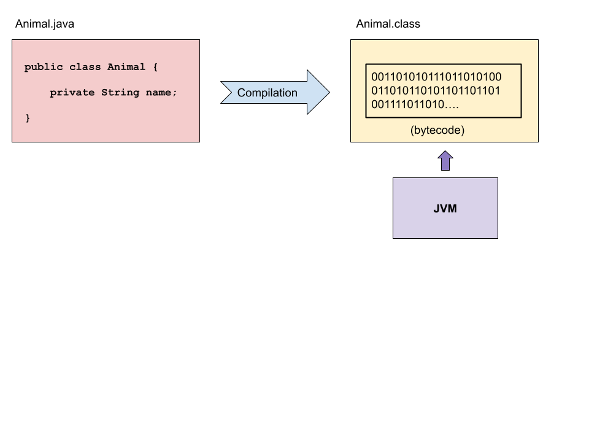

<!-- _class: lead -->

# Java Intro

---

<!-- _class: objectives -->

## Learning objectives

- Why Java?
- What is Java?
- Compilers
- Variables
- Arrays
- Loops
- Conditionals
- Installing
- Primitives
- Strings

---

<!-- _class: mind-map -->

## Why Java?


- OO Language
- Popular
- Oracle
- Web / Desktop / Mobile
- REST APIs
- Open source / Free

---

<!-- _class: image-panel-right -->

## What is Java

- General purpose, Object Oriented programming language
- Been around since 1990s
- Still active today - stays modern
- Compiled language

Some useful terms

- **JDK** - **Java Development Kit** - collection of tools and libraries for developing Java applications
- **JVM** - **Java Virtual Machine** - runs Java applications using Java classes (bytecode)


---

## Compilation

<div class="grid" >

<article>

Java is a compiled language.

Compilation is the process of converting one programming language into another, the Java compiler converts Java source code into bytecode.

Compiled bytecode and JVM gives Java its power - **write once, run anywhere**

</article>
<article>

For Java the process is:

1. Write a Java source file - **Animal.java**
2. Compile into bytecode - **Animal.class**
3. Run with application with JVM

</article>
</div>



---

## Java basics - variables

<div class="grid">

<article>

- **All** variables must have a type
- The type can be a **primitive** or a **class**

### Primitive types

- `boolean`
- `char`
- `byte`
- `short`
- `int`
- `long`
- `float`
- `double`

</article>

```java
// boolean variable
boolean myBoolean = false;

// char variable
char myChar = 'a';

// byte variable
byte myByte = 100;

// short variable
short myShort = 30_000;

// int variable
int myInt = 100_000_000;

// long variable
long myLong = 100_000_000_000_000;

// float variable
float myFloat = 1.456f;

// double variable
double myDouble = 1.456789012345678;
```

</div>

---

<!-- _class: thought-box -->

## Java basics - arrays

<div class="grid">

<article>
<h3>Arrays</h3>

- Arrays in Java work like JavaScript
- Except arrays in Java are fixed length! 😱

```java

int[] ages = { 7, 10, 4, 17, 23 };
String[] names = { "Butch", "Fido", "Scobbie", "Bob", "Rex" };

ages[0] = 8;

ages.length; // 5

String firstName = names[0]; // "Butch"

```

</article>

<article>

<h3>Logging</h3>

- Output can be logged to the terminal using System.out

<div class="flex" style="margin-top: 80px;">

```java

int age = 27
System.out.println("Hello world"); // Hello world
System.out.println("Age is " + age); // Age is 27

```

</div>

</article>

</div>

📜 In legacy code you may see `new int[]` when declaring an array, but it is no longer required

---

## Java basics - loops

<div class="grid">

<article>
<h3>Loops</h3>

- **for** loops and **while** loops work as in JavaScript

<div class="flex" style="margin-top: 80px;">

```java
for( int i = 0; i < names.length ; i++ ) {
    System.out.println( "Name: " + names[i] );
}
```

</div>

<div class="flex" style="margin-top: 50px;">

```java
int i = 0;
while ( i < names.length ) {
    System.out.println( "Age: " + ages[i] );
    i++;
}
```

</div>

</article>

<article>
<h3>Conditional</h3>

- **if** and **if** ... **else** statements works as JavaScript

<div class="flex" style="margin-top: 80px;">

```java
if( age >= 18 ) {
    System.out.println("You can see an 18 film!");
} else if( age >= 15 ) {
    System.out.println("You can see a 15 film!");
} else {
    System.out.println("You can see PG film!");
}

```

</div>

</article>

</div>

---

<!-- _class: thought-box -->

## Required setup

- Install AWS Java SDK - version 11 <br/>
  https://aws.amazon.com/corretto

- Download IntelliJ community edition<br/>
  https://www.jetbrains.com/idea/download

<div class="flex" style="margin-top: 120px; margin-bottom: 50px;">


</div>
<p>Let's go to work...</p>

---

<!-- _class: thought-box -->

## Primitive types

- Primitive types in Java are special - they are **not** objects!

<table style="margin-top: 0px;">
  <tr>
    <th>Type</th>
    <th>Memory</th>
    <th>Range</th>
  </tr>
  <tr>
    <td>boolean</td>
    <td>1 bytes (8 bits)</td>
    <td>true or false</td>
  </tr>
  <tr>
    <td>char</td>
    <td>2 bytes (16 bits)</td>
    <td>0 to 65535</td>
  </tr>
  <tr>
    <td>byte</td>
    <td>1 byte (8 bits)</td>
    <td>-127 to 128</td>
  </tr>
  <tr>
    <td>short</td>
    <td>2 bytes (16 bits)</td>
    <td>-32768 to 32767</td>
  </tr>
  <tr>
    <td>int</td>
    <td>4 bytes (32 bits)</td>
    <td>-2147483648 to 2147483647</td>
  </tr>
  <tr>
    <td>long</td>
    <td>8 bytes (64 bits)</td>
    <td>-9,223,372,036,854,775,808 to 9,223,372,036,854,775,807</td>
  </tr>
  <tr>
    <td>float</td>
    <td>4 bytes (32 bits)</td>
    <td>very large</td>
  </tr>
  <tr>
    <td>double</td>
    <td>8 bytes (64 bits)</td>
    <td>even larger</td>
  </tr>
</table>

🤔Why is this important?

---

<!-- _class: thought-box -->

## Overflow and casting

<div class="grid" >
<article>

- What happens if we try to assign a larger sized type to a smaller one?
- What happens if we try assign an int to a byte? 🤔

We get **overflow**!

Rather like trying to get a gallon into a pint - it just won't go! 😥

- **Casting** allows us to assign a larger sized type to a smaller one
- But it **doesn't** prevent overflow - do so at your own risk!

</article>

<article>

```java

byte b = 24; // all good
int i = 42; // no problems here

// larger size to small size

b = i; // syntax error - danger of overflow!

b = (byte) i; // all good - casting solves problem


int i2 = 3000;

byte b2 = (byte) i2; // ok
System.out.println( b2 ); // -72 😝


```

</article>
</div>

Want to assign a smaller sized type to a larger one? No problem! 😃

---

## Strings

<div class="grid" >

<article>

- `String` is a **class** - not a primitive
- Wrap in double quotes `"` - single not valid!
- Strings can be concatenated using `+`
- Many useful methods:
  - `length()` - gets the length of a String
  - `toLowerCase()` - gets a copy of the String in lower case
  - `toUpperCase()` - gets a copy of the String in upper case
  - `substring()` - gets a substring of a String
  - `split()` - generates an array of Strings using the delimiter to split

</article>

<article>

```java

String greeting = "Hello";

String welcome = greeting + " there";

welcome.length(); // 11
welcome.toUpperCase() // HELLO THERE
welcome.split(" ") // [ "Hello", "there"]
welcome.substring( 0, 4 ); // Hell

System.out.println( welcome ); // Hello world (unchanged)

```

</article>
</div>

---

<!-- _class: activity  -->

## Java challenges

Download the java-challenges from GitHub

- https://github.com/nology-tech/java-challenges.git

Open repository in **IntelliJ**

- New project > From existing sources
- Click on `challenges` folder within `java-challenges` - **important!**
- Select project framework > Maven

Do challenges under `com.nology.introduction_01` packages, in the Challenge class

<div class="grid" >

<div>

</div>

</div>
