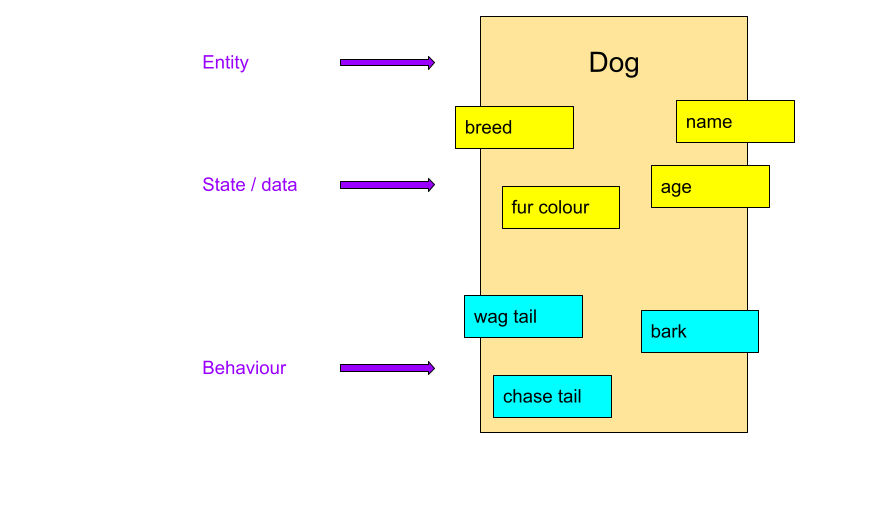

<!-- _class: lead -->

# Classes and Objects

---

<!-- _class: objectives -->

## Learning objectives

- Classes and objects
- Abstraction
- Encapsulation
- Variables and methods
- Access modifiers

---

<!-- _class: mind-map -->

## Recap


- JDK
- Primitives
- Compilation
- Arrays
- Overflow
- Casting
- String

---

## Objects

"an object is an entity that has state (data) and behaviour"

- **entity** - anything - a car, an animal, a shopping receipt or a transaction
- **state** - data it knows about or how to describe it
- **behaviour** - what it can do
- We model in objects because they mirror real life
- The Java `String` class - use for holding strings of text.



---

<!-- _class: image-panel-right -->

## Abstraction

**Abstraction** is one of the four pillars of Object Oriented (OO) programming.

- only focus on the key or important data and behaviour
- hide the inner complexity of an object
- rather like a **black box** - you don't know what's going inside
- user/client can focus on what object does not how it does it


---

<!-- _class: thought-box -->

## Classes

<div class="grid" >

<article>

- Java class is a like a blueprint for an object
- You need a **class** to create an **object**
- A `class` definition describes an object
- **Variables** - hold the state or data
- **Methods** - define the behaviour
- One class per file, with same name as class
- Class naming convention is Pascal case
- Method and variable naming convention is camel case

</article>

```java

class Dog {

    // variables
    String name;
    int age;

    // methods
    void bark() {
        System.out.println("Woof woof says " + this.name);
    }
    void wagTail() {
        System.out.println(this.name + " wags their tail!");
    }

}

```

</div>

💡 **Abstraction** in action - only hold what's important!

---

## Variables

<div class="grid" >

<article>

- Variables belong to the object - instance variables
- Variables can be primitive types or class
- Variables can be given a default value
- `final` keyword makes a variable into a constant
- Naming convention for constants is SNAKE_CASE
- Access using the '.' notation

</article>

```java

class Dog {
    final int MIN_AGE = 1;
    String name;
    int age = 7;
}

Dog rover = new Dog();

rover.name = "Rover";
rover.MIN_AGE = 2; // syntax error!

System.out.println( rover.name ); // Rover
System.out.println( rover.age ); // 7

```

</div>

---

<!-- _class: thought-box -->

## Methods

<div class="grid" >

<article>

- Methods belong to the object - instance methods
- Methods can access **all** the variables and methods
- Methods can have parameters
- Use `void` if the method returns nothing
- Otherwise method **must** return a type or primitive
- Use `return` to return from a method, with a value if required
- Call method using the '.' notation

</article>

<article>

```java

class Dog {
    String name;
    String getName() {
        return this.name;
    }
    void setName(String name) {
        this.name = name;
    }
    void bark() {
        System.out.println("Woof");
    }
}

Dog rover = new Dog();
rover.setName("Rover");
System.out.println( rover.getName() ); // Rover

```

</article>
</div>

Methods help protect an object's data - **encapsulation**!

---

## The `main` method

<div class="grid" >

<article>

- A `main` method is special - allows access to run the class
- Must be declared as `public static void main`
- Must have a single parameter of type:<br/> `String[]`
- _Any_ class can have a `main` method - but **only one**!
- Without a main method wouldn't be able to run a Java program

</article>

<article>

```java

class Dog {
    String name;
    String getName() {
        return this.name;
    }
    void setName(String name) {
        this.name = name;
    }
    void bark() {
        System.out.println("Woof");
    }
    public static void main(String[] args) {

        Dog rover = new Dog();

        rover.setName("Rover");
        System.out.println( rover.getName() ); // Rover
        rover.bark(); // Woof
    }
}

```

</article>
</div>

---

## Using objects

<div class="grid" >

<article>

- An **object** is created from a **class**
- Use the `new` keyword to create or construct a new object
- Many objects can be created from a single class
- Each new object created is **unique**!
- Variables and methods are accessed using the '.' notation
- Variables for objects are **references** or **pointers**

</article>

```java

// create a new Dog object
Dog fido = new Dog();

fido.name = "Fido";
fide.age = 4;

// create a new Dog object
Dog rex = new Dog();

rex.setName("Rex");
rex.bark();


```

</div>

---

<!-- _class: activity  -->

## Java challenge

Create a new class for a **Celebrity**

What data/variables would it have?

- Create variables to hold these

What behaviour would it have?

- Create methods to represent these

Create your an instance of your new class, set any variables and call any methods.

Create another instance and populate it with different data.

---

<!-- _class: image-panel-right -->

## Encapsulation

**Encapsulation** is one of the four pillars of OO programming.

- means hiding your data from other clients/users
- controlling access to your data
- protects internal state of an object


---

<!-- _class: thought-box -->

## Encapsulation in Java

<div class="grid" >

<article>

- Variables can be made `private`
- Methods can be made `private`
- Setters and getters are common access methods
- Methods help protect an object's data
- Public methods allow access to an object's data - in a controlled way

</article>

<article>

```java

public class Dog {

    private String name;

    public String getName() {
        return this.name;
    }
    public void setName(String name) {
        this.name = name;
    }

    public static main(String[] args) {
        Dog rover = new Dog();
        rover.setName("Rover");
        System.out.println( rover.getName() ); // Rover
    }
}

```

</article>
</div>

💡 There are other levels of access as well as `private` and `public`

---

<!-- _class: thought-box -->

## Access modifiers

Access modifiers allow classes to protect or hide their data and methods.

- This is **abstraction** and **encapsulation** in Java
- Access modifiers can be used against classes, variables and methods
- Four levels of access:

<table style="margin-top: 0px;">
  <tr>
    <th>Modifier</th>
    <th>Description</th>
    <th></th>
  </tr>
  <tr>
    <td>private</td>
    <td>instances of class only</td>
    <td>most restrictive</td>
  </tr>
  <tr>
    <td></td>
    <td>instances of class or any class in same package</td>
    <td></td>
  </tr>
  <tr>
    <td>protected</td>
    <td>instances of class, any class in same package or subclass</td>
    <td></td>
  </tr>
  <tr>
    <td>public</td>
    <td>any class</td>
    <td>least restrictive</td>
  </tr>
</table>

✍️ We'll come back to packages and subclasses!

---

## Access modifiers in action

<div class="grid" >

<article>

- Use access modifiers to restrict access to inner working of class
- Provide methods to allow client access to key data
- Classes are typically `public`
- Getter and setters are typically `public`
- Variables are typically `private` - **encapsulation** again!

</article>
<article class="flex" >

```java

public class Dog {

    private String name;
    private int age;

    public String getName() {
        return this.name;
    }
    public void setName(String name) {
        this.name = name;
    }
    // other getters and setters

    public void bark() {
        System.out.println("Woof woof says " + this.name);
    }
    public void wagTail() {
        System.out.println(this.name + " wags their tail!");
    }
}

```

</article>

</div>

---

<!-- _class: image-panel-right -->

## Zoology Time ! 🐯🐵🐼

Welcome to Nology's very own Zoo - **Zoology**!

We are going to be building an application that is the basis for a Zoo game or simulation.

The Zoo will have animals that can be fed, visited and even petted (but be careful!)

The player will be able to play the role of a visitor or a zoo keeper.

The possibilities are endless ...

<br/>

**But** first ... we need some animals! 👍


---

<!-- _class: activity  -->

## Challenges 🐯🐵🐼

These challenges use the Zoology application.

<div class="grid" >

<div>

### 1. Animal classes

In the package `com.nology.zoology.animal`

- Create a new class for a Tiger

  - it should have an id (integer), a name and an age
  - it should have suitable getters and setters
  - it should have a method to make sound

- Create new classes for a Llama and a Crocodile
  - they should have same variables and methods as Tiger

</div>

<div>

### 2. Creating animals

In the main method for of the `ZooPlayground` class:

- Create an object for each of the different animal classes
- You should fully populate object - that is all the variables
- For each of the animal objects print out their details; id, name and age.

**Extension**

- Is there a better way to print out an object's details? Maybe a method?
- If you wanted to create a few Tiger objects the code would quickly become repetitive - is there a better way?

</div>

</div>

---

<!-- _class: activity  -->

## Java challenges

If you've finished the previous challenges then you can continue with the challenges in the `java-challenges` project

Do challenges under `com.nology.controlflow_02` packages, in the Challenge class
