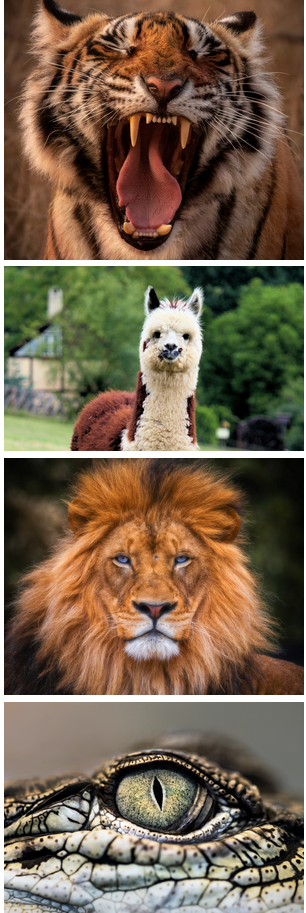

<!-- _class: lead -->

# Constructors, Inheritance and Polymorphism

---

<!-- _class: objectives -->

## Learning objectives

- Constructors
- Inheritance
- Polymorphism

---

<!-- _class: mind-map -->

## Recap


- Abstraction
- Variables
- Methods
- Encapsulation
- `private`
- `main` method
- Class
- Object

---

<!-- _class: thought-box -->

## Constructors

<div class="grid" >

<article>

- A constructor is a special type of method
- A constructor is called when an object is created using `new`
- Every class **must have** a constructor
- If you don't write a constructor Java will provide one - the **default** constructor!
- A constructor can take parameters like any method

</article>

```java

public class Cat {
    private String name;
    // default constructor provided!
}

public class Dog {
    private String name;
    public Dog(String name) {
        this.name = name;
    }
}


Cat cat = new Cat(); // use default constructor
Dog dog = new Dog("Butch");
Dog anotherDog = new Dog("Trixie");

```

</div>

🤔 What can we use a constructor for?

---

## Overloaded constructors

<div class="grid" >

<article>

- You can have **multiple constructors** on the same class
- But they must have **different** parameter lists
- This is called constructor **overloading**

</article>

```java

public class Dog {
    private String name;
    private int age;
    public Dog(String name, int age) {
        this.name = name;
        this.age = age;
    }
    public Dog(String name) {
        this.name = name;
        this.age = 6;
    }
}

Dog dog = new Dog("Butch", 12);
Dog anotherDog = new Dog("Trixie");
System.out.println(dog.getAge()) // 12
System.out.println(anotherDog.getAge()) // 6

```

</div>

---

<!-- _class: image-panel-right -->

## Zoology Time ! 🐯🐵🐼

So we have some animals! Great start!

However ... creating them is a bit of a pain! 😜

🤔 How could we simplify the creating of the new animal classes?



---

<!-- _class: activity -->

## Challenge 🐯🐵🐼

These challenges use the Zoology application.

- Add a constructor that takes all the fields to the Tiger class
- Add another constructor to Tiger that just takes id and name and also defaults the age to 7
- Update the ZooPlayground to use the new constructors

---

<!-- _class: image-panel-right -->

## Inheritance

**Inheritance** is one of the four pillars of OO programming.

- Allows an object to be based on another object
- A IS-A relationship between two objects
- A parent-child relationship
- A child object can add **additional data and behaviour**
- Allows code re-use


---

## Inheritance in Java

<div class="grid" >

<article>

- Use `extends` to extend a parent class
- Parent is also known as super class
- Child is also known as sub class
- Child class potentially can access all parent's variables and methods ...
- ... depending on their visibility!
- Subclasses can add additional variables and methods
- `final` will stop a class from been extended - see `String`

</article>

```java

// parent or super class
public class Animal {
    private String name;
    public Animal(String name) {
        this.name;
    }
    public String getName() {
        return this.name;
    }
}

// child or sub class
public class Dog extends Animal {
    private String breed;
    public Dog(String name, String breed) {
        super(name);
        this.breed = breed;
    }
    public String getBreed() {
        return this.breed;
    }
}

```

</div>

---

<!-- _class: image-panel-right -->

## Polymorphism

**Polymorphism** is one of the four pillars of OO.

- Polymorphism means many forms
- Allows objects to behave differently in certain cases
- Allows a child to change behaviour inherited from its parent

<!-- .svg) -->


---

## Polymorphism in Java

<div class="grid" >

<article>

### Overriding

- Subclass can **override** a parent method - changing behaviour
- `@Override` annotation is used to indicate an overridden method
- Within a method `super` refers to the super or parent class
- `final` will stop a method from been overridden

</article>

```java

public class Animal {
    String name;
    public Animal(String name) {
        this.name = name;
    }
    public void makeSound() {
        // nothing
    }
}

public class Dog extends Animal {
    @Override
    public void makeSound() {
        System.out.println( this.name + " goes woof");
    }
}

Dog rover = new Dog("Rover");
rover.makeSound(); // Rover goes woof

```

</div>

---

## Polymorphism in Java

<div class="grid" >

<article>

### Overloading

- Method with the same name but a **different** parameter list
- Method with same name but different parameter list can behave differently
- Constructors can be overloaded too

</article>

```java

public class Animal {
    String name;
    public void makeSound() {
        // nothing
    }
}

public class Dog extends Animal {
    @Override
    public void makeSound() {
        System.out.println( this.name + " goes woof");
    }
    public void makeSound(int times) {
        for( int i=0; i < times; i++ ) {
            makeSound();
        }
    }
}

```

</div>

---

## The Object class

<div class="grid" >

<article>

- Every Java class is a descendant of the Object class
- If class doesn't explicitly extend a class then it extends Object
- That means _every single_ Java object is an Object
- Every class can override any of them

</article>

```java

public class Cat {

    private String name = "Tom";
    @Override
    public String toString() {
        return "Cat called " + this.name;
    }
}
Cat cat = new Cat();
System.out.println(cat); // Cat called Tom

```

</div>

### Important methods

<table style="margin-top: 0px;">
  <tr>
    <th>Method</th>
    <th>Description</th>
    <th>Usage</th>
  </tr>
  <tr>
    <td>equals</td>
    <td>checks equality</td>
    <td>if( a.equals(b) ) ...</td>
  </tr>
  <tr>
    <td>hashCode</td>
    <td>returns a unique integer for that Object</td>
    <td>System.out.print(a.hashCode()) // 1945604815 </td>
  </tr>
  <tr>
    <td>toString</td>
    <td>converts the object to a String</td>
    <td>String out = a.toString();</td>
  </tr>
</table>

---

<!-- _class: thought-box -->

## References and objects

<div class="grid" >

<article>

- Variables for objects are actually references or pointers
- They point to or reference the object in memory
- The **type** of a reference determines what you can do with an object!
- A reference for a class can point to an **object of that class** ...
- ... **or any** of it's subclasses

</article>

<article>

```java

public class Animal {
    // ...
}

public class Cat extends Animal {
    // ...
}

Cat cat = new Cat("Scoobie");
Animal animal = new Cat("Tigger"); // valid!
animal = cat; // also valid!


```

</article>
</div>

👉 An object will **never** change its type!

---

<!-- _class: image-panel-right -->

## Zoology Time ! 🐯🐵🐼

We have lots of animal classes now!

However, we really seem to be repeating ourselves ...

- ... they all have an id
- ... they all have a name
- ... they all have an age

Three different classes with lots in common - feels wrong somehow 🤔

**What** can we do?


---

<!-- _class: activity -->

## Challenges - 1 🐯🐵🐼

These challenges use the Zoology application.

### 1. Animal class

<div class="grid" >

<div>

In the package `com.nology.zoology.animal`

- Create a new parent class called Animal

  - it should have an id (integer), a name and an age - what access modifier could they have? 🤔
  - it should have suitable getters and setters
  - it should have a constructor that takes **all** the variables

- Add a method `makeSound()` to `Animal`, it should do nothing

</div>

<div>

- Add a method `getInformation()` to Animal, it should return an empty String

- Override the toString() to display some useful information, for example displaying the id, name and age. For example:<br/>
  `Animal[id=23, name='Leo', age=7]`

</div>

</div>

---

<!-- _class: activity -->

## Challenges - 2 🐯🐵🐼

These challenges use the Zoology application.

### 2. Creating child classes

<div class="grid" >

<div>

In the package `com.nology.zoology.animal`

- Modify the animal classes - Tiger, Llama and Crocodile - so they inherit from the new Animal class
- Add a suitable constructor to each new class
- Remove the redundant fields and methods - no longer required
- Ensure the makeSound() method overrides the parent's version

</div>

<div>

In the main method for of the `ZooPlayground` class:

- Use the latest version of the classes to create your animals
- Make sure to use the new constructors!

**Extension**

Could you make the Animal `getInformation()` more useful, rather than having to override it?

</div>

</div>

---

<!-- _class: activity  -->

## Java challenges

If you've finished the previous challenges then you can continue with the challenges in the `java-challenges` project

Do challenges under `com.nology.classes_03` package, in the `Challenge` class
