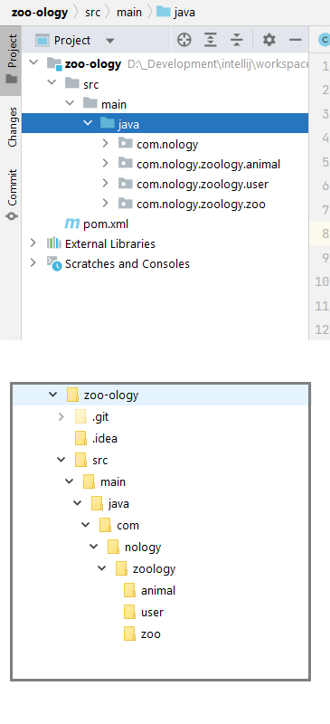

<!-- _class: lead -->

# Packages, Structure and Data Structures

---

<!-- _class: objectives -->

## Learning objectives

- Packages and imports
- Class structure
- Arrays
- ArrayLists

---

<!-- _class: mind-map -->

## Recap


- Inheritance
- `Object` class
- Overriding
- Overloading
- Polymorphism
- Constructors
- `@Override`
- `extends`

---

<!-- _class: image-panel-right -->

## Packages

<div class="grid" >

<article>

What are packages for? 🤔

- a way to organise our classes
- a way to group classes together
- a way to prevent class name collisions!

- Packages directly map onto directories
- `package' declaration must be first declaration in Java file

The full or qualified name for a class includes the package:

- `java.lang.String`
- `java.util.ArrayList`
- `com.nology.zoology.animal.Tiger`

</article>

<article>

```java

package com.nology;

import java.util.ArrayList;

public class ZooPlayground {

    private ArrayList<String> someNames = new ArrayList<>();

}

```

</article>
</div>



---

<!-- _class: thought-box -->

## Imports

<div class="grid" >

<article>

- You can reference classes by their qualified name
- However this would soon become tedious
- `import` allows us to reference a class using just its class name
- Imports are always at the top of file - after any package declaration.
- If there are two classes with the same name ...
- ... one will have to use its qualified name

</article>

<article>

```java

package com.nology;

import java.util.ArrayList;
import java.util.List;

public class ZooPlayground {

    private List<String> someNames = new ArrayList<>();
    private java.awt.List forDisplay = new java.awt.List();
    private String zooName = "London Zoo";


}

```

</article>
</div>

👉 `java.lang` classes are **automatically** imported!

---

<!-- _class: thought-box -->

## Class structure

<div class="grid" >

<article>

- Structure is good!😀
  <br/>
- Structure helps **you**
- Structure helps **other** developers

</article>

```java

public class Animal {

	// constants

	// variables

	// constructors

	// getters and setters

	// methods

	// toString
}
```

</div>

🖐️ and don't forget to **format** your code too - use Ctrl + Alt + L!

---

## Arrays

- Java arrays are fixed length sequential collection of elements that are all the **same type**
- Arrays can be for any type - primitives or classes
- Arrays are objects - so use `new` to create if you don't want to add any values
- If you try and go beyond the bounds of an array Java will complain!

<div class="flex"; style="margin-top: 100px;">

```java

// one dimensional
int[] ages = new int[5];

// OR
int[] ages = { 17, 21, 12, 7, 24};

String[] films = { "Alien", "Jaws", "Batman", "Coco" };

// two dimensions
BoardSquare[][] chessBoard = new BoardSquare[8][8];

```

</div>

---

## Accessing arrays

- Access elements using the `[]` notation, start at 0 as with JavaScript
- Use `.length` for length of array
- You can use `for` or enhanced `for` loops to iterate

<div class="grid">

<div>

### Accessing

```java
String[] names = new String[] { "Butch", "Rex", "Luna", "Tricksie" };

System.out.println( names[0] ); // Butch
System.out.println( names.length ); // 4
System.out.println( names[names.length-1] ); // Tricksie

```

</div>
<div>

### for loop

```java
String[] names = new String[] { "Butch", "Rex", "Luna", "Tricksie" };

for( int i = 0; 0 < names.length; i++ ) {
    System.out.println( "A good dog name is " +  names[i] );
}

```

</div>
<div>

### Enhanced for loop

```java
String[] names = new String[] { "Tiddles", "Princess", "Scobbie", "Maisie" };

for( String name : names ) {
    System.out.println( "A good cat name is " + names );
}
```

</div>

</div>

---

<!-- _class: image-panel-right -->

## Zoology Time ! 🐯🐵🐼

We have lots of animal classes now!

They are all subclass the `Animal` class - so super easy to create new ones!

So, now we need somewhere to keep our animals!

A Zoo - a collection of animals! Sounds like a plan! 🎉


---

<!-- _class: activity -->

## Challenge 🐯🐵🐼

These challenges use the Zoology application.

### 1. Zoo

<div class="grid" >

<div>

Create a new package `com.nology.zoology.zoo`

In the new package

- Create a new class called `Zoo`

  - it should have an array for storing some Tigers, say 10

- Add a method `addTiger()` which takes a Tiger object and adds it to the array of Tigers

- Add a method `getAnimalCount()` which returns the number of animals in zoo

- Can you spot any draw backs with this method? 🤔

</div>

<div>

In the main method for of the `ZooPlayground` class:

- create a new `Zoo` object

- add some Tiger objects to the zoo

- print out how many tigers the zoo has

</div>
</div>

---

<!-- _class: thought-box -->

## ArrayLists

- `ArrayList` is a Java class that's similar to a JavaScript array
- `ArrayList` is a full blown object
- An `ArrayList` can **only** hold classes - no primitives
- Elements are added, removed and replaced using methods
  - `add(element)` - add a new element to end of list
  - `add(index, element)` - add a new element at given index
  - `get(index)` - get the element at given index
  - `set(index, element)` - set or replace element at given index
  - `remove(index)` - remove element at given index
  - `size()` - get the size or length of the list
  - `contains(element)` - check if list contains given element

💡 **ArrayList** has plenty of useful methods - check out the docs!

---

## Wrapper classes

<div class="grid" >

<article>

- For every primitive type there is an associated wrapper class
- This allows classes like `ArrayList` to store and use numbers, booleans etc
- Typically name of class is primitive with a capital letter, for example wrapper short for `Short`
- Exceptions are:
  - int - `Integer`
  - char - `Character`
- No need to convert between the two because of **autoboxing** and **unboxing**

</article>
<article>

```java

int myInt = 24;
Integer myInteger = new Integer(24);
Integer myInteger2 = Integer.valueOf(24); // preferred way of doing

Integer myInteger3 = 24; // autoboxing

int anotherInt = myInteger.intValue(); // 24


```

</article>
</div>

---

<!-- _class: activity -->

## Challenge 🐯🐵🐼

These challenges use the Zoology application.

### 1. Adding animals

<div class="grid" >

<div>

In the `Zoo` class

- add ArrayLists for llamas and crocodiles

- add corresponding `addLlama()` and `addCrocodile()` methods

- update the `getAnimalCount()` method to reflect changes

</div>

<div>

In the main method for of the `ZooPlayground` class:

- add tigers, llamas and crocodiles to the zoo!

**Extension**

In the `Zoo` class add method to print out all the animals in the zoo.

In `ZooPlayground` print out the zoo's animals using new method.

</div>
</div>

---

## Revisiting Inheritance

💡 Is there a better way to store our animals?

- If we need to add a new animal - say Lion?
- What needs to change at the moment?

Let's use **inheritance** to help!

---

## Revisiting Inheritance

💡 Is there a better way to store our animals?

- If we need to add a new animal - say Lion?
- What needs to change at the moment?

Let's use **inheritance** to help!

<div class="flex" >

```java

Lion lion = new Lion(2, "Leo", 6);
Animal anotherLion = new Lion(3, "Leslie", 8);

Llama llama = new Llama(4, "Lorenzo", 3);


ArrayList<Animal> animals = new ArrayList<>();

animals.add( lion );
animals.add( anotherLion );
animals.add( llama );

```

</div>

---

<!-- _class: activity -->

## Challenge 🐯🐵🐼

These challenges use the Zoology application.

### 1. Simplify Zoo

<div class="grid" >

<div>

In the `Zoo` class

- simplify the storing of animals using a single `ArrayList`

- modify the add animal methods accordingly

- update the getAnimalCount() method to reflect changes

- add a method getAnimals() that returns all animals in zoo

</div>

<div>

In the main method for of the `ZooPlayground` class:

- Do you need to change anything here?

- If not - why? 💡

**Extension**

How could we simplify the adding of the various animals to the `Zoo` class even further?

💡 Think about **method overloading** and **inheritance**

</div>
</div>

---

<!-- _class: activity  -->

## Java challenges

If you've finished the previous challenges then you can continue with the challenges in the `java-challenges` project

Do challenges under `com.nology.arraysloops_04` packages, in the Challenge class
