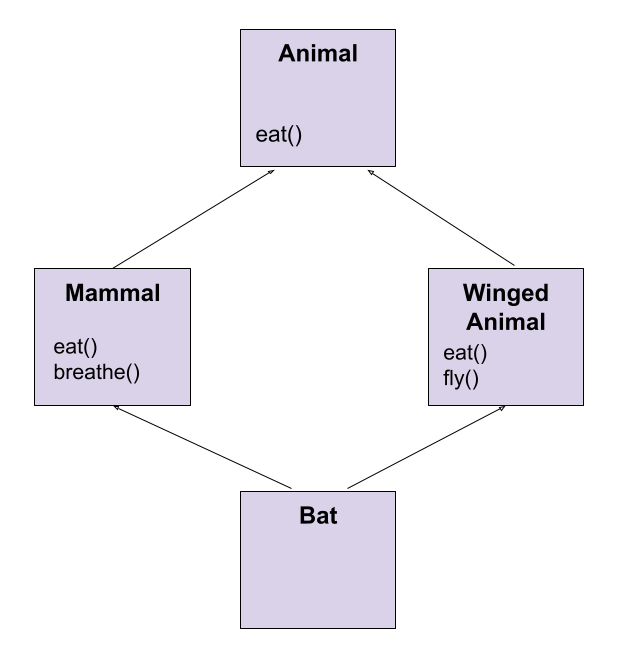
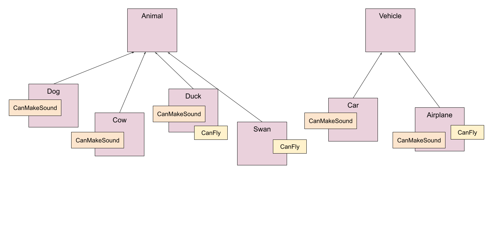

<!-- _class: lead -->

# Interfaces

---

<!-- _class: objectives -->

## Learning objectives

- What are interfaces?
- Multiple inheritance
- Interfaces in Java
- Implementing interfaces
- Example interfaces

---

<!-- _class: mind-map -->

## Recap


- Enums
- `values()`
- `enum` constructors
- Abstract class
- Concrete class
- Abstract method

---

<!-- _class: thought-box -->

## Interfaces

- Interfaces are super important!
- Interfaces are used **everywhere** in Java
- Interfaces can be tricky to grasp! 🤔

<br/>

- An interface defines what a class should do ...
- ... not how to do it!
- An interface is a **100% abstract** class
- All methods and no implementations

🤔 What would this be in the real world?

---

<!-- _class: thought-box image-panel-right -->

## Real World Interfaces

When you write an interface, you're saying: **"I need something that can..."**

If we had a Mobile, Tablet and Laptop we could create these interfaces:

- **Displayable**, have display functionality

- **Chargeable**, have to be able to charge

- **ReceiveCall**, have to be able to receive a call

They could all have the functionality but different implementations of how they achieve it.

We can start to group objects by what functionality they have!


🤔 Why do we have interfaces in Java?

---

## Multiple inheritance

<div class="grid" >

<article>

- Multiple inheritance - where a class has two or more parents - a bit like humans!
- Java **doesn't** do multiple inheritance.

<br/>

🤔 Why not?

- The Deadly Diamond of Death!
- Which `eat()` method implementation do we call? 😱

<br/>

<div class="flex" >

```java

Bat bruce = new Bat();
bruce.breathe(); // no problem
bruce.fly(); // all fine here
bruce.eat(); // oh no - which one??

```

</div>

</article>
<article>



</article>

</div>

---

## Interfaces in Java

<div class="grid" >

<article>

- Interfaces in Java allow multiple inheritance in Java ...
- ... to a point
- An interface defines what needs to be done, not how to do it
- On an interface **all** methods are abstract 🤫
- On an interface **all** variables are constants
- Use `interface` keyword to define an interface
- An interface can extend another interface - **inheritance**!
- All methods are **public** and **abstract** implicitly - typically left off

</article>
<article>

```java

public interface CanMakeSound {

    void makeSound();

}
public interface CanFly {

    int TOP_SPEED_MPH = 20;
    void fly();

}

```

</article>
</div>

---

## Implementing interfaces

<div class="grid" >

<article>

- A class implements an interface using `implements` keyword
- A class can implement multiple interfaces
- Unless abstract a class must implement **all** interface methods
- Note use of `@Override` annotation - because overriding an abstract method
- Inheritance represents an **IS-A** relationship, so do interfaces!
- Can use `instanceof` to check if a class implements an interface
- Interfaces allows **polymorphism** to the n'th degree! 😃

</article>
<article>

```java

public interface CanMakeSound {
    void makeSound();
}
public interface CanFly {
    void fly();
}

public class Bat implements CanMakeSound, CanFly {
    @Override
    public void makeSound() {
        System.out.println("Squeak!");
    }
    @Override
    public void fly() {
        System.out.println("Flap, flap");
    }
}
// all valid - IS-A relationship !
Bat bat = new Bat();
CanFly flier = bat;
CanMakeSound soundMaker = bat;

```

</article>
</div>

---

## Advantages of interfaces

- Polymorphism, polymorphism, polymorphism!
- Ultimate in flexibility - use as variable types, argument types and return types
- An interface can be implemented across multiple inheritance trees
- Allows a class to play multiple roles as well as the class type they were created with

<div class="flex" >



</div>

---

<!-- _class: activity -->

## Challenge

<div class="grid" >

<div>

Create a class called `Farm`

- add a `List` of type `Animal`

- on creation of Farm object it should create a number of different Animal objects and add to them List of animals.

- add a method called `getAnimals()`, which should return a list of all the animals

- add a method called `getAnimalsThatMakeSound()`, which should return a list of only those animals that make a sound. Hint: the instance of the list should be `CanMakeSound`

</div>

<div>

- add a method called `getAnimalsThatFly()`, which should return a list of only those animals that can fly. Hint: the type of list should be `CanFly`.

**Extension**

- add a method called `getAnimalsThatFlyAndMakeSound()`, which should return a list of only those animals that can fly and make a sound. What could the return type be here?

<div class="flex" >


</div>

</div>
</div>

---

## Interfaces within Java

<div class="grid" >
<article>

### List

- `List` - describes a list - an ordered collection of objects
- Different implementations for different use cases
- Implementations include ArrayList, LinkedList, and Stack.

<div class="grid grid--col-1" >

```java

public interface List {
    T get(int index);
    T add(T element);
    void set(int index, T element);
    T remove(int index);
    boolean contains(T element);
    int size();
    boolean isEmpty();
}

```

</div>
</article>

<article>

### Set:

- `Set` - collection of unique elements.
- It does not allow duplicate values.
- Implementations include HashSet, TreeSet, and LinkedHashSet.

### Map

- `Map` - represents a mapping between keys and values.
- It associates a unique key with a value.
- Implementations of the Map interface include HashMap, TreeMap, and LinkedHashMap.

</article>

<article class="flex" >

</article>

</div>

---

## Zoology Time ! 🐯🐵🐼

So at the Nology Zoo we want to be able to sort our animals. Lets start by sorting by their unique id.

**Collections.sort()** is a static method that sorts a **List** of elements in order based on either:

- The elements implementing the **Comparable** interface.
- The method is passed a class that implements the **Comparator** interface.

<div class="grid">
<article>

### Comparable interface

Allows objects to define their natural ordering on the class.

The `compareTo()` method is defined in this interface to provide the comparison logic.

The String class implements the Comparable interface, allowing strings to be sorted based on their lexicographical order 😅.

</article>

```java

public interface Comparable {
    int compareTo(T another);
}


public abstract class Animal implements Comparable<Animal> {

  private int id;

  @Override
  public int compareTo(Animal other) {
      return this.id - other.id;
  }
}

```

</div>

---

## Zoology Time ! 🐯🐵🐼

We want to be able to sort them in a variety of ways! Not just by Id, what about by animal name?

<div class="grid">
<article>

### Comparator interface

Allows you to define custom comparison logic when you want to override the default comparison behavior.

It provides the compare() method to compare two objects given as parameters.

The return value indicates ordering between two objects

Java also provides some implementations of the interface

e.g. `Comparator.reverseOrder()` will reverses the natural ordering of objects. It is useful when you want to sort objects in descending order.

</article>

```java

public interface Comparator {
    int compare(T left, T right);
}


public class SortByAnimalName implements Comparator<Animal> {

    @Override
    public int compare(Animal left, Animal right) {
        if( left.getName().equals(right.getName()) ) {
            return left.getType().compareTo( right.getType() );
        }
        return left.getName().compareTo( right.getName() );
    }

}

```

</div>

---

<!-- _class: activity -->

## Challenge 🐯🐵🐼

These challenges use the Zoology application.

### More Animal Sorting!

Create a class `SortByAnimalTypeThenName` in the animal package.

- it should implement the Comparator class and it should sort by animal type and then name.

### Improved listing

In animal package update the `AnimalSorting` enum. It should have the values - byId, byName, byType.

In the `Zoo` class

- modify method so it sorts the list of animals using the appropriate method
