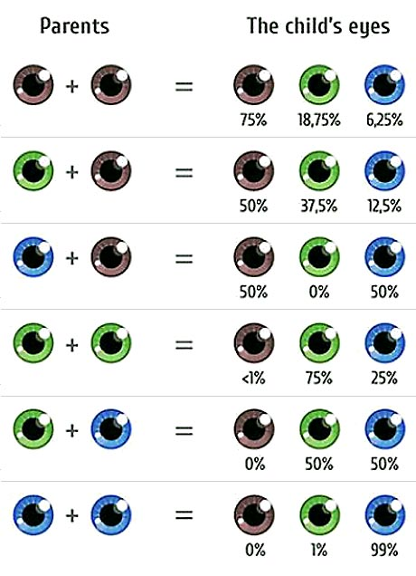

## Challenge: Tell me the day!

### MVP:

Create a switch block that will log a string for each day of the week.

1. Create a variable called `day`
1. The switch will be given a number and return the matching days of the week
1. e.g. if `day = 2`, the switch should print `Today is Tuesday` in the console.
1. Your switch block should also handle numbers out of range

## Challenge: Eye Colour

### MVP:

Tell the user what eye colour their child would have.

1. Create two variables `parent1` and `parent2`
1. Given the eye colour of each parent, it should console log the probability
   of their child having different eye colours, for example:
   `Your eye colours are brown and blue, the chances of your child having blue eyes is --%, brown is --% and green is --%`
1. Use the following image as a reference

### Bonus:

Store the value of the child’s eye colour and write a switch statement - depending on the child’s eye colour consol log if it's your favourite eye colour, your least favourite eye colour or the mediocre colour
